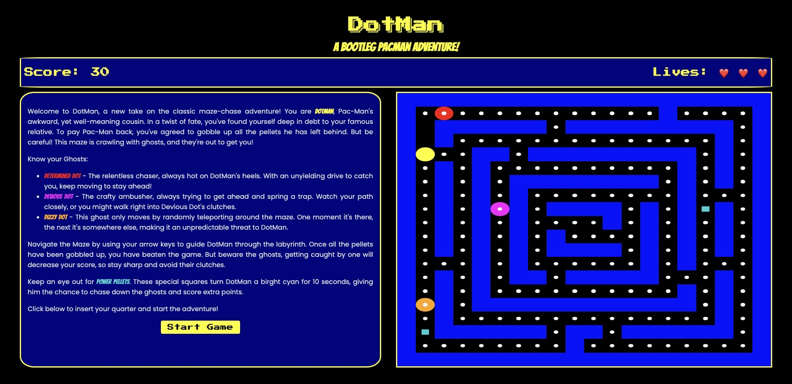

<div align="right">

</div>

# DotMan - A Bootleg PacMan Adventure

## Overview

This is my first project of the software engineering bootcamp at General Assemby, London. The assignment was to create a grid-based game to be rendered in the browser, using HTML, CSS, and JavaScript. The project was to be completed individually within one week.

I chose to create DotMan, as an ode to the classic PacMan maze game. DotMan mostly follows the same dynamics as PacMan, however, a few twists have been added, most notably a ghost that can teleport randomly across the maze in a sort of whack-a-mole style, adding a new challenge to the game.

Please note that whilst the game bio in the HTML is centered on DotMan, and the three opposing dots, this documentation is written in terms of the original Pac-Man lingo, e.g. referring to ghosts, PacMan, and power pellets as the underlying code also uses this jargon.

## Game Preview

#### Landing Page


Start screen with game story and instructions.

#### Main Gameplay


Active gameplay showing PacMan collecting pellets while ghosts pursue.

#### Power Up


PacMan in powered-up state with vulnerable ghosts.

#### Ghost House


Defeated ghost temporarily confined to Ghost House.

## Quick Links

- [Play the Game](https://milochambers96.github.io/PacMan-Clone/)
- [GitHub Repository](https://github.com/milochambers96/PacMan-Clone)

## Technologies Used

- HTML5
- CSS3
- JavaScript (ES6)
- Git and GitHub
- Google Fonts

## Game Implementation

### Grid System

The game is built on a 20x20 grid system, creating a total of 400 cells. The maze layout is defined using a numerical system:

- 0: Path (regular pellet)
- 1: Wall
- 2: Power pellet location
- 3: Ghost house area
- 4: Ghost house door

```javascript
const height = 20;
const width = 20;
const gridSize = width * height;
```

### Character System

#### PacMan

PacMan is the player-controlled character with the following key features:

- **Position Tracking**: Maintains current position on grid
- **Power State**: Can be powered up by eating power pellets
- **Movement**: Controlled by arrow keys with wall collision detection
- **Visual State**: Changes appearance when powered up

```javascript
const pacman = {
  position: 21,
  poweredUp: false,
  // Methods for display and movement
};
```

### Ghost System

The game features three distinct ghost types, each with unique behavior patterns designed to create diverse challenges for the player.

#### 1. Chaser Ghost

The Chaser Ghost implements a direct pursuit strategy:

- Uses Breadth-First Search (BFS) for pathfinding
- Continuously updates path to PacMan's position
- Maintains path history for retreat scenarios

#### 2. Ambusher Ghost

The Ambusher Ghost employs sophisticated dual-mode AI:

##### Ambush Mode (Default)

When more than 4 cells away from PacMan, it uses predictive targeting:

```javascript
function getAmbushPosition(pacmanPosition, pacmanDirection) {
  let targetPosition;
  const targetOffset = 4; // Looks 4 cells ahead
  switch (pacmanDirection) {
    case "up":
      targetPosition = pacmanPosition - targetOffset * width;
      break;
    case "down":
      targetPosition = pacmanPosition + targetOffset * width;
      break;
    case "left":
      targetPosition = pacmanPosition - targetOffset;
      break;
    case "right":
      targetPosition = pacmanPosition + targetOffset;
      break;
    default:
      targetPosition = pacmanPosition;
  }
  return targetPosition;
}
```

This system:

- Calculates an intercept point 4 cells ahead of PacMan
- Attempts to cut off PacMan's expected path
- Falls back to direct pursuit if calculated position is invalid

##### Pursuit Mode (Close Range)

Switches to direct pursuit when within 4 cells of PacMan:

- Uses Manhattan distance to calculate proximity
- Directly targets PacMan's current position
- Creates more aggressive close-range behavior

#### 3. Random Ghost (Teleporter)

The Random Ghost adds an unique element of unpredictability through its teleportation mechanics:

```javascript
function moveRandomGhost() {
  randomPosition = Math.floor(Math.random() * cells.length);
  if (isValidMove(randomPosition)) {
    randomGhost.move(randomPosition);
    checkCollision();
  }
}
```

Key Features:

- **Teleportation**: Every 3 seconds, attempts to teleport to a random position
- **Position Validation**: Ensures teleport destination is a valid path cell
- **Power Pellet Interaction**: Teleportation pauses during power pellet mode
- **Spawn Protection**: Can't teleport directly onto PacMan's position
- **Ghost House Logic**: Can teleport in/out of ghost house when doors are open

Strategic Impact:

- Forces players to constantly scan the entire maze
- Creates sudden danger zones
- Adds unpredictability to escape planning
- Balances predictable ghost patterns with random threats

### Pathfinding Implementation

#### Breadth-First Search (BFS)

The game implements BFS for ghost pathfinding:

```javascript
function bfs(start, destination) {
  const directions = [
    { move: width, direction: "down" },
    { move: -width, direction: "up" },
    { move: 1, direction: "right" },
    { move: -1, direction: "left" },
  ];

  const queue = [{ position: start, path: [] }];
  let visited = new Set();
  visited.add(start);

  while (queue.length > 0) {
    let { position, path } = queue.shift();
    if (position === destination) {
      return path;
    }
    for (const { move, direction } of directions) {
      const newPosition = position + move;
      if (isValidMove(newPosition) && !visited.has(newPosition)) {
        visited.add(newPosition);
        queue.push({ position: newPosition, path: [...path, direction] });
      }
    }
  }
  return [];
}
```

### Game Mechanics

#### Scoring System

- Regular Pellet: 10 points
- Power Pellet: 50 points
- Eating Ghost: 250 points
- Getting caught: -500 points

#### Power-Up System

When PacMan consumes a power pellet:

- Ghosts become vulnerable
- Ghost house doors become walls
- Duration: 10 seconds
- Random ghost teleportation pauses

#### Lives System

- Player starts with 3 lives
- Lives are lost upon ghost collision
- Final life triggers special warning
- Game over when all lives are lost

### Setup and Installation

1. Clone the repository:

```bash
git clone https://github.com/milochambers96/PacMan-Clone.git
```

2. Open index.html in your browser

### Controls

- Use arrow keys to move PacMan
- Press the start button to begin the game
- Collect all pellets to complete the game

## Technical Challenges and Solutions

1. **Ghost Pathfinding**

   - **Challenge**: Initially used Manhattan distance, leading to ghosts getting stuck
   - **Solution**: Implemented BFS for optimal pathfinding through maze

2. **Power Pellet State Management**

   - **Challenge**: Coordinating multiple ghost behaviors during power-up
   - **Solution**: Centralized power-up state with ghost house door manipulation

3. **Random Ghost Teleportation**

   - **Challenge**: Ensuring valid teleport locations and preventing unfair spawns
   - **Solution**: Implemented comprehensive position validation system

4. **Ghost Behavior Coordination**
   - **Challenge**: Managing different ghost behaviors without overwhelming the player
   - **Solution**: Balanced timing and patterns through extensive playtesting

## Future Improvements

1. Multiple levels with increasing difficulty
2. High score system with local storage
3. Mobile-responsive controls
4. Sound effects and background music
5. Additional ghost behavior patterns
6. Power-up variety
7. Enhanced teleportation effects for Random Ghost
8. Dynamic difficulty adjustment based on player performance

## Credits

- Original PacMan concept by Namco
- Project completed as part of General Assembly's Software Engineering Bootcamp

## Post 1 Week Sprint Updates

### November 2024

#### Movement Control System

The game now uses a unified movement system that handles both keyboard and touch inputs:

```javascript
function handleMovement(direction) {
  let newPosition;
  switch (direction) {
    case "left":
      if (pacman.position % width !== 0) {
        newPosition = pacman.position - 1;
        pacmanDirection = "left";
      }
      break;
    case "up":
      if (pacman.position >= width) {
        newPosition = pacman.position - width;
        pacmanDirection = "up";
      }
      break;
    case "right":
      if (pacman.position % width < width - 1) {
        newPosition = pacman.position + 1;
        pacmanDirection = "right";
      }
      break;
    case "down":
      if (pacman.position < gridSize - width) {
        newPosition = pacman.position + width;
        pacmanDirection = "down";
      }
      break;
  }
  if (newPosition !== undefined) {
    pacman.move(newPosition);
    pacmanAteAPellet();
    checkCollision();
  }
}
```

#### Swipe Detection

Added touch controls with minimum swipe threshold:

```javascript
function addSwipeControls() {
  let touchStartX = 0;
  let touchStartY = 0;
  const grid = document.querySelector("#grid");

  grid.addEventListener("touchstart", (e) => {
    touchStartX = e.touches[0].clientX;
    touchStartY = e.touches[0].clientY;
  });

  grid.addEventListener("touchend", (e) => {
    const touchEndX = e.changedTouches[0].clientX;
    const touchEndY = e.changedTouches[0].clientY;

    const deltaX = touchEndX - touchStartX;
    const deltaY = touchEndY - touchStartY;

    const minSwipeDistance = 30;

    if (
      Math.abs(deltaX) > Math.abs(deltaY) &&
      Math.abs(deltaX) > minSwipeDistance
    ) {
      handleMovement(deltaX > 0 ? "right" : "left");
    } else if (Math.abs(deltaY) > minSwipeDistance) {
      handleMovement(deltaY > 0 ? "down" : "up");
    }
  });
}
```

### Interface Redesign

- Streamlined game interface with centred layout
- Transformed start screen into focused instruction panel
- Improved transition between instructions and gameplay
- Added mobile-friendly swipe controls for smoother gameplay
- Enhanced scrollable content for better readability
- Maintained arcade aesthetic whilst improving usability

### Visual Improvements

- Centred game components for better visual balance
- Fixed UI scaling issues
- Improved instruction panel navigation
- Standardised dimensions for consistent mobile/desktop experience
- Responsive scaling for different screen sizes

### Technical Updates

- Implemented swipe detection with minimum distance threshold
- Added touchstart/touchend event handling for mobile gameplay
- Unified movement logic for both touch and keyboard controls
- Optimised UI element scaling for mobile devices

### Known Issues

- Could improve UI responsiveness on very small screens
- Touch sensitivity may need further calibration

### January 2025

#### Responsive Design Optimization

- Implemented consistent viewport scaling using min(600px, 90vh, 90vw)
- Added transform scale(0.85) for laptop screens to ensure content fits viewport
- Removed redundant CSS properties to improve maintainability
- Enhanced cross-device compatibility ensuring balanced visual presentation
- Fixed spacing issues across mobile, laptop, and desktop views

#### Game Logic Improvements

- Fixed score synchronization in end-game scenarios
- Corrected score display mismatches between UI and game-end alerts
- Added proper score update timing for both win and loss conditions
- Ensured UI score accurately matches final score in alerts

#### Mobile Controls Enhancement

- Fixed double-movement issue after game reset on mobile devices
- Refactored swipe controls to use named handler functions
- Implemented proper cleanup of touch event listeners
- Added safeguards against duplicate swipe handlers
- Improved touch control responsiveness and reliability

### Known Issues

- Original known issues from November 2024 have been resolved
- Continue monitoring mobile touch sensitivity for user feedback

## Controls

- Mobile: Swipe in desired direction (up/down/left/right)
- Desktop: Arrow keys
- Press the start button to begin the game
- Collect all the pellets without the ghosts catching you to complete the game
